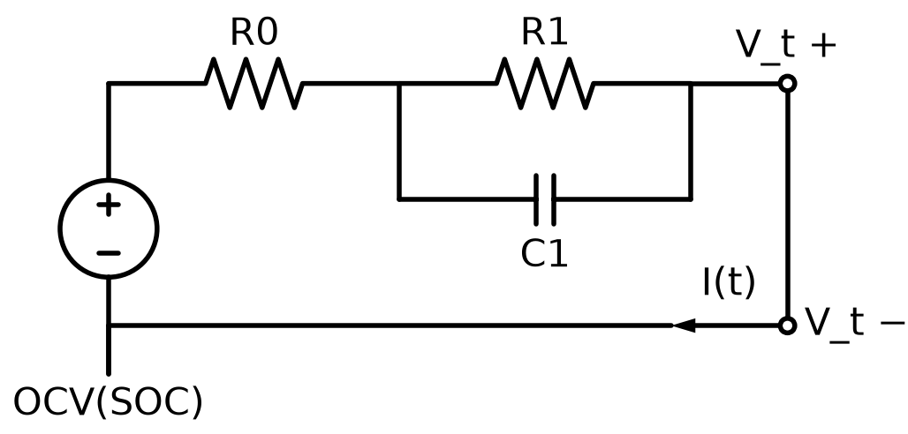

# Battery ECM + Kalman Filter SOC Estimation

배터리 1차 등가회로 모델(Equivalent Circuit Model)과 칼만 필터를 이용한
SOC(State of Charge) 추정 프로젝트입니다.

**타겟 직무**: LG에너지솔루션 CTO BMS_SOX 알고리즘 설계 / ESS전지사업부 System개발

## 왜 이 문제가 중요한가

SOC(배터리 잔존용량 비율)는 전기적으로 직접 측정할 수 없는 화학적 상태량입니다.
외부에서 측정 가능한 값은 전류(I)와 단자전압(V_t) 뿐이며, 둘 다 SOC를 간접적으로만
반영합니다.

- 전류 적분(쿨롱카운팅)은 원리적으로 정확하지만 센서 노이즈가 시간에 따라 누적(drift)됩니다.
- 단자전압은 부하전류에 의한 전압강하(IR drop, 분극)로 진짜 개방전압(OCV)이 가려져 있습니다.

이 두 신호를 칼만필터로 융합해서 서로의 약점을 상쇄시키는 것이 이 프로젝트의 핵심입니다.

## 진행 단계

- [x] **Phase 1** — 1차 RC 등가회로 배터리 모델 (`battery_model.py`)
- [x] **Phase 2** — 노이즈 섞인 가짜 측정 데이터 생성 (`generate_noisy_measurements.py`)
- [x] **Phase 3** — 칼만 필터 구현 (`kalman_filter.py`)
- [x] **Phase 4** — 검증 및 시각화 (`evaluate_estimation.py`)

## Phase 4 — 최종 검증: 칼만필터 vs 쿨롱카운팅

칼만필터와 "칼만필터 없이 전류만 적분하는 방식(쿨롱카운팅)"을 공정하게
겨루게 했습니다 — 오히려 쿨롱카운팅에게 유리한 조건(정확한 초기값)을
주고, 칼만필터는 불리한 조건(20%p 틀린 초기값)에서 시작시켰습니다.

전류 센서에 현실적인 고정 편향(bias, 정격전류의 1.5%)을 추가하자
결과가 뚜렷하게 갈립니다:

| | RMSE | 60분 뒤 최종오차 |
|---|---|---|
| 쿨롱카운팅만 | 0.85%p | -1.48%p (계속 벌어지는 중) |
| 칼만필터 | 0.51%p | -0.44%p (더 이상 안 벌어짐) |

쿨롱카운팅은 시간이 지날수록 오차가 선형으로 계속 커지는(drift) 반면,
칼만필터는 전압 측정으로 계속 보정되어 오차가 일정 범위 안에서
진동만 하고 커지지 않습니다. `soc_estimation_result.png` 참고.

## Phase 3 — 선형 칼만필터

상태공간 모델은 Phase 1과 동일(선형)하지만, 측정방정식은 OCV(SOC) 룩업테이블
때문에 비선형입니다. 매 스텝 현재 SOC 추정치 근처에서 OCV 곡선의 국소
기울기(dOCV/dSOC)로 선형화해서 표준 칼만필터 수식을 그대로 적용했습니다.

노이즈 공분산(Q, R)은 임의로 튜닝하지 않고 Phase 2에서 실제로 설정한
센서 스펙(전류 ±0.02A, 전압 ±0.005V)에서 이론적으로 유도했습니다.

**검증**: 일부러 20%p 틀린 초기값(SOC 80%, 진짜는 100%)에서 시작해도
1분 이내에 오차가 0.1%p 이하로 수렴합니다 (`kalman_sanity_check.png`).

## Phase 2 — 측정 노이즈 모델

실제 센서는 항상 오차를 갖습니다. 이를 재현하기 위해 전류/전압에 평균 0의
가우시안(정규분포) 노이즈를 더했습니다.

| 신호 | 노이즈 표준편차 |
|---|---|
| 전류 | ±0.02 A |
| 단자전압 | ±0.005 V |

`measurements.csv`에는 `measured_*`(노이즈 낀 관측치, Phase 3 입력용)와
`true_soc`/`true_*`(정답, Phase 4 채점 전용) 컬럼이 함께 저장되어 있습니다.
Phase 3의 칼만필터 코드는 `true_*` 컬럼을 참조하지 않습니다.

## 회로 모델



전지 기호(OCV)가 SOC의 함수인 전압원이고, R0는 직렬 내부저항,
R1‖C1은 분극(polarization)을 표현하는 병렬 RC 회로입니다.
V_t(단자전압)만 유일하게 측정 가능한 출력입니다.

상태공간 표현:

```
dSOC/dt = -I / Q
dV1/dt  = -V1/(R1*C1) + I/C1
V_t     = OCV(SOC) - I*R0 - V1
```

## 실행 방법

```bash
pip install -r requirements.txt
python3 battery_model.py
```

`true_simulation.csv`(정답 데이터)와 `discharge_simulation.png`(전류/전압/SOC 그래프)가 생성됩니다.

## 실무 연결

이 로직은 실무에서 MATLAB/Simulink + Embedded Coder로 구현되어 실제 BMS 펌웨어에
탑재됩니다. 본 프로젝트는 Python으로 SOC 추정 알고리즘의 핵심 개념을 빠르게
검증한 프로토타입입니다.
